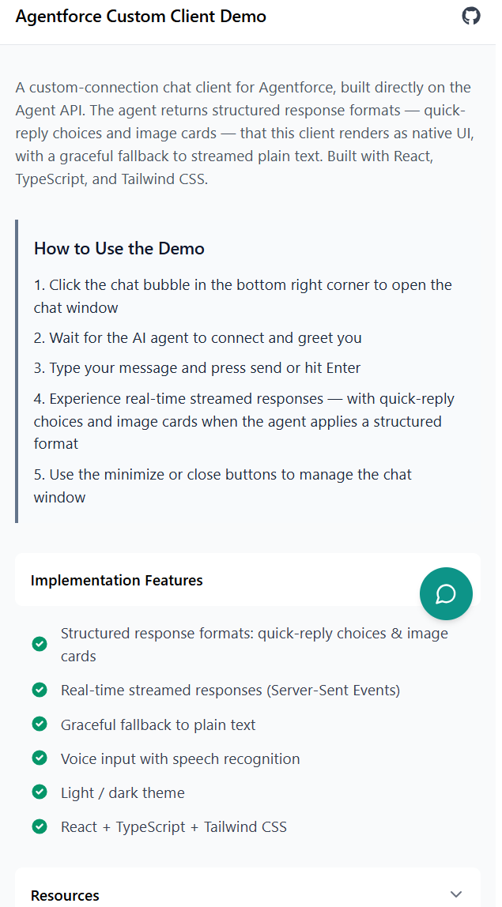
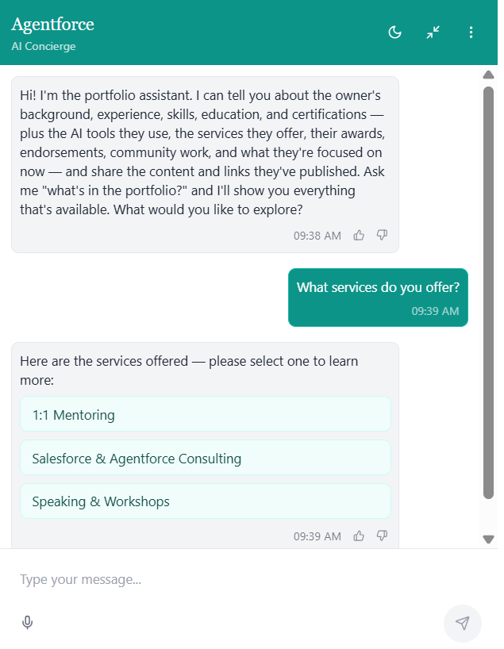
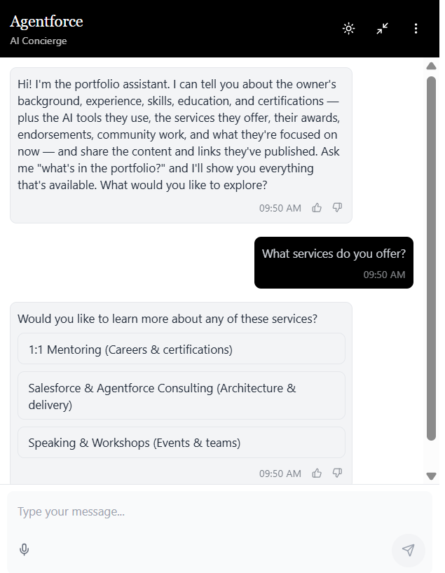

# Agentforce Custom Chat Client

[](https://github.com/SalesforceDiariesBySanket/Agentforce-Custom-Connection-Chat-Client/actions/workflows/ci.yml)
[](./LICENSE)

A modern React-based chat interface for **Agentforce** built directly on the
[Agent API](https://developer.salesforce.com/docs/ai/agentforce/guide/agent-api-get-started.html).
It uses [Custom Connections](https://developer.salesforce.com/docs/ai/agentforce/guide/custom-connections.html)
so the agent can return **structured response formats** (quick-reply choices,
image card carousels) that the client renders as native UI — while everything
else falls back to streamed plain text. Built with React, TypeScript, Tailwind
CSS, and Fastify.

> **Why the Agent API and not MIAW?** Custom connections (the `surfaceConfig`
> with structured response formats) are an Agent API feature. The Messaging for
> In-App and Web (MIAW) API is a separate, Salesforce-managed `Messaging`
> surface and cannot return custom response formats — so this client talks to
> the Agent API directly.

## Demo

Captured from a **live Agent API session**. When a turn maps to 2–7 pickable
items, the agent emits a **Text Choices** structured format that the client
renders as tappable buttons; anything else falls back to streamed plain text. A
light/dark theme is built in.

<table>
  <tr>
    <td align="center"><b>Landing page</b></td>
    <td align="center"><b>Text Choices — light</b></td>
    <td align="center"><b>Text Choices — dark</b></td>
  </tr>
  <tr>
    <td valign="top"></td>
    <td valign="top"></td>
    <td valign="top"></td>
  </tr>
</table>

## Features

- 💬 Real-time streamed responses (Server-Sent Events from the Agent API)
- 🎛️ Structured response formats via custom connections:
  - Clickable quick-reply **Text Choices**
  - Image **card carousels** (Choices With Images)
- 🔌 Graceful fallback to plain text when no format is applied
- 🎙️ Voice input support with speech recognition
- 🌓 Light/dark theme support
- 📱 Fully responsive design

## Architecture

```
Browser (React)  ──►  Fastify server (proxy)  ──►  Salesforce Agent API
   fetch + SSE          OAuth token + session         /einstein/ai-agent/v1
```

The server keeps your client credentials secret, mints the OAuth token, manages
sessions, and proxies the streaming responses.

## How the Custom Connection Works

A [**custom connection**](https://developer.salesforce.com/docs/ai/agentforce/guide/custom-connections.html)
lets an Agentforce agent return **structured response formats** — not just
prose — to an external (non-Salesforce) client over the Agent API. For a turn,
the agent emits a small JSON payload (a list of choices, or image cards) that
_this_ client renders as native UI. The agent applies **at most one format per
turn**, and anything the client doesn't recognize falls back to streamed text.

It has three moving parts that all have to agree on the same contract:

1. **Salesforce (metadata)** — _declares_ the response formats and the surface.
2. **Salesforce agent (Agent Script)** — _decides when_ to emit a format.
3. **Client (server proxy + React)** — _opts into_ the surface and _renders_ the format.

```
Agent Script instructions          AiResponseFormat  (JSON input schema)
   "present 2–7 items as choices"        │  declares the shape of a format
        │                                ▼
        │                         AiSurface (surfaceType = Custom)
        │                                │  enables the formats
        ▼                                ▼
   model picks ONE format  ───►   GenAiPlannerBundle.plannerSurfaces (wires it to the agent)
        │
        ▼   result[0].type = "SURFACE_ACTION__TextChoices_CustomChatClient01"
        │   result[0].value = "{ \"message\": \"...\", \"choices\": [...] }"
        ▼
   Server proxy  ── starts session with surfaceConfig.surfaceType="Custom"
                 ── streams SSE, extracts result[0] → { name, data }
        │
        ▼
   React  ── resolveFormatName() → ResponseFormatRenderer → buttons / image cards
          (unknown or invalid → plain-text markdown)
```

> **Why the Agent API and not MIAW / Enhanced Chat?** Custom connections are an
> **Agent API** feature: `surfaceType = Custom` is one of the surface types
> (alongside the Salesforce-managed `Messaging`, `Telephony`, and `NextGenChat`).
> The managed channels can't return your custom response formats, so this client
> talks to the Agent API directly.

### 1. What we did on the Salesforce side (metadata)

All of this lives in [`metadata/unpackaged/`](./metadata/README.md) and is
deployed with the Metadata API (**v66.0+** is required for custom connections).

**a. Defined the response formats** — each
[`AiResponseFormat`](./metadata/unpackaged/aiResponseFormats/TextChoices_CustomChatClient01.aiResponseFormat)
describes _what a structured reply looks like_ via a JSON Schema in its
`<input>`, a `<description>`, and `<instructions>` that tell the agent when the
format applies:

- `TextChoices_CustomChatClient01` — `{ message, choices: string[] }`
- `ChoicesWithImages_CustomChatClient01` — `{ message, choices: [{ title, imageUrl, actionText }] }`

Both are scoped to **2–7 mutually exclusive choices** so the client always has a
sensible number of buttons/cards to render.

**b. Created the custom surface** —
[`CustomChatClient_CustomChatClient01.aiSurface`](./metadata/unpackaged/aiSurfaces/CustomChatClient_CustomChatClient01.aiSurface)
ties everything together:

- `<surfaceType>Custom</surfaceType>` — marks it as a _custom connection_.
- `<responseFormats>` — enables the two formats above on this surface.
- Surface-level `<instructions>` — global rules such as _"don't use a format for
  plain prose"_ and _"don't use a format for more than 7 choices."_

> `CustomChatClient01` is the **surfaceId** — a suffix that links the surface to
> its response formats. It appears in the file names, the `<responseFormat>`
> references, and the planner-bundle `<surface>` value. Rename it everywhere to
> change it; the client is written to not care what it is (see §3).

**c. Wired the surface into the agent** — a surface does nothing until the
agent's `GenAiPlannerBundle` references it through a `plannerSurfaces` entry:

```xml
<plannerSurfaces>
    <callRecordingAllowed>false</callRecordingAllowed>
    <surface>CustomChatClient_CustomChatClient01</surface>
    <surfaceType>Custom</surfaceType>
</plannerSurfaces>
```

> ⚠️ Deploying a `GenAiPlannerBundle` **replaces** it. Always **retrieve your
> real, fully-populated bundle**, add the block, and redeploy — never deploy a
> stub, or you'll wipe the agent's topics and actions.

**Deploy order:** response formats → surface → planner bundle. The manifest
handles ordering automatically (`AiResponseFormat` before `AiSurface`):

```bash
# from metadata/
sf project deploy start --manifest unpackaged/package.xml
```

### 2. What we did on the Salesforce agent side (Agent Script)

Declaring the surface is necessary but **not sufficient** — emitting a format is
**instruction-driven and nondeterministic**. The agent evaluates each format's
`description`/`instructions` and picks at most one per turn; if none fits, it
replies with plain text. So the agent only produces a structured response when
its **Agent Script instructions tell it to**.

**a. Opt-in presentation instructions.** In
[`Personal_Portfolio_Agent.agent`](./agentscript/force-app/main/default/aiAuthoringBundles/Personal_Portfolio_Agent/Personal_Portfolio_Agent.agent),
the relevant subagents (`portfolio_overview`, `about_owner`, `content_links`)
include a `PRESENTATION` block that says, in effect:

> When an action returns **2–7 pickable items**, present them as selectable
> **Text Choices** (one choice per item) with a short intro `message`. When each
> item has a real, non-blank `imageUrl`, present them as **Choices With Images**
> instead. Fall back to direct text for a single item, for >7 items, or for
> descriptive prose.

> A previous version of the agent repeatedly said _"Always compose your response
> as direct text,"_ which suppressed **every** format. That line had to be
> replaced with the opt-in guidance above before any format would appear.

**b. Grounded the image URLs.** An imperative _"you MUST use ChoicesWithImages"_
made the model **fabricate** `example.com` image URLs. The wording that works:
_"copy the **EXACT** `imageUrl` the action returned, character for character;
never invent, shorten, or use a placeholder; if blank or unsure, use text-only
choices."_ The Apex action (`PortfolioItemProvider`) must actually **return**
`imageUrl` in its output for the cards to have images.

**c. Publish → re-apply surface → activate (every change).** Each instruction or
Apex change needs a fresh cycle, run from the `agentscript/` directory:

```bash
sf agent validate authoring-bundle --api-name Personal_Portfolio_Agent
sf agent publish  authoring-bundle --api-name Personal_Portfolio_Agent   # permanent version
# re-retrieve the regenerated planner bundle, re-insert <plannerSurfaces>, redeploy it
sf agent activate --api-name Personal_Portfolio_Agent
```

> **Why re-apply the surface after every publish?** `publish` regenerates the
> `GenAiPlannerBundle` **without** the `plannerSurfaces` block, so it must be
> re-added and the bundle redeployed. `activate` does **not** strip it.

### 3. What we did on the client side

The client never sees Salesforce credentials. A small **Fastify proxy** mints the
token, opts into the surface, and streams responses; the **React** app parses the
stream and renders the formats.

#### Server proxy ([`server/src/handlers/`](./server/src/handlers/))

- **OAuth token** — [`salesforce-auth.ts`](./server/src/handlers/salesforce-auth.ts)
  mints an Agent API token with the **client-credentials** flow against the org's
  My Domain, caches it, and force-refreshes on any `401`. The Agent API base URL
  comes from the token response's `api_instance_url` (overridable via `SF_API_HOST`).
- **Opt into the custom connection** — [`chat-session-handler.ts`](./server/src/handlers/chat-session-handler.ts)
  starts the session with `surfaceConfig: { surfaceType: "Custom" }`. **This is
  the request-side half of the custom connection** — without it the agent only
  ever replies with plain text.
- **Extract the format** — `parseAgentMessages()` reads `result[0]` from each
  agent message. The name arrives as `result[0].type = "SURFACE_ACTION__<name>"`;
  the proxy strips the `SURFACE_ACTION__` prefix and `JSON.parse`s
  `result[0].value` into `{ name, data }`. Invalid JSON falls back to text.
- **Stream proxy** — [`chat-message-handler.ts`](./server/src/handlers/chat-message-handler.ts)
  pipes the Agent API SSE stream (`/messages/stream`) straight to the browser.

#### React client ([`client/src/`](./client/src/))

- **Parse the SSE stream** — [`useAgentApi.ts`](./client/src/hooks/useAgentApi.ts)
  routes each event (`TextChunk`, `ProgressIndicator`, `Inform`, `EndOfTurn`,
  `ValidationFailureChunk`, `Error`); `extractResponseFormat()` pulls the format
  off the final `Inform` message (same `SURFACE_ACTION__` parsing as the server).
- **Resolve the format name (the surface-id-agnostic bit)** —
  [`formatRegistry.ts`](./client/src/components/chat/formatRegistry.ts) is the key
  piece. Salesforce's docs say the runtime name is the developer name _without_
  the `_{surfaceId}` suffix, but in this project's testing the suffix was
  **present** (`TextChoices_CustomChatClient01`). So `resolveFormatName()` matches
  on the **base-name prefix** (`rawName === base || rawName.startsWith(base + "_")`)
  and renders correctly **either way**. `isKnownFormat()`/`isRenderable()` also
  validate the payload shape before rendering (the platform does not enforce the
  schema).
- **Render** — [`ResponseFormats.tsx`](./client/src/components/chat/ResponseFormats.tsx)
  renders **Text Choices** as a vertical list of buttons and **Choices With
  Images** as a horizontal card carousel; selecting a choice fires `onSelect`.
- **Format OR text, never both** — [`ChatMessage.tsx`](./client/src/components/chat/ChatMessage.tsx)
  shows the `ResponseFormatRenderer` when a known format is present and **hides**
  the streamed markdown text. _That's why the intro sentence must live in the
  format's `message` field_, not in the agent's prose.
- **Choice → follow-up turn** — [`useChat.ts`](./client/src/hooks/useChat.ts)
  feeds a tapped choice back as the next user message; a `ValidationFailureChunk`
  resets the in-progress bubble.

#### Adding a new format

1. Add an `AiResponseFormat`, reference it from the `AiSurface`, and deploy.
2. Add a base-name constant + a renderer branch in `formatRegistry.ts` /
   `ResponseFormats.tsx`. Unrecognized formats fall back to plain text.

## Prerequisites

- Node.js >= 20.0.0
- pnpm >= 8.x
- A Salesforce org with an **activated Agentforce agent** (not the
  "Agentforce (Default)" type, which the Agent API doesn't support)
- An **External Client App** configured for the OAuth client credentials flow
- (Optional, for structured formats) the custom connection metadata in
  [`metadata/`](./metadata/README.md) deployed to your org

## Set Up Your Salesforce Org

1. **Create an External Client App (ECA)** for the client credentials flow.
   Follow [Get Started with the Agent API](https://developer.salesforce.com/docs/ai/agentforce/guide/agent-api-get-started.html).
   Enable OAuth with the scopes `api`, `refresh_token offline_access`,
   `chatbot_api`, and `sfap_api`; enable the **Client Credentials Flow**; and set
   a **Run As** user that has API access and access to the agent.
2. **Copy the Consumer Key and Secret** from the app's OAuth settings.
3. **Get your Agent ID** — see
   [Get the Agent ID](https://developer.salesforce.com/docs/ai/agentforce/guide/agent-api-get-agent-id.html).
4. **(Optional) Deploy the custom connection metadata** so the agent returns
   structured formats — see [`metadata/README.md`](./metadata/README.md). Skip
   this and the app still works with plain-text responses.

## Quick Start

1. Install dependencies:

   ```bash
   pnpm install
   ```

2. Configure environment variables:

   ```bash
   cd server
   cp .env.example .env
   ```

   Update `server/.env`:

   ```env
   SF_MY_DOMAIN_URL=https://your-domain.my.salesforce.com
   SF_CLIENT_ID=your-eca-consumer-key
   SF_CLIENT_SECRET=your-eca-consumer-secret
   SF_AGENT_ID=0Xx...
   # Optional
   SF_API_HOST=https://api.salesforce.com
   SF_SURFACE_TYPE=Custom
   SF_BYPASS_USER=true
   PORT=8080
   ```

3. Start development servers:

   ```bash
   # Start both client and server
   pnpm dev

   # Or start individually:
   pnpm dev:client   # Client at http://localhost:5173
   pnpm dev:server   # Server at http://localhost:8080
   ```

## Available Scripts

- `pnpm dev` - Start both client and server in development mode
- `pnpm dev:client` - Start client development server
- `pnpm dev:server` - Start backend development server
- `pnpm build` - Build both client and server
- `pnpm start` - Start production server

## Environment Variables

### Server

| Variable           | Description                                                                                  | Required |
| ------------------ | -------------------------------------------------------------------------------------------- | -------- |
| `SF_MY_DOMAIN_URL` | My Domain URL, e.g. `https://your-domain.my.salesforce.com`                                  | Yes      |
| `SF_CLIENT_ID`     | External Client App consumer key                                                             | Yes      |
| `SF_CLIENT_SECRET` | External Client App consumer secret                                                          | Yes      |
| `SF_AGENT_ID`      | Agent ID (`0Xx...`) to converse with                                                         | Yes      |
| `SF_API_HOST`      | Agent API host (default `https://api.salesforce.com`; gov: `https://api.gov.salesforce.com`) | No       |
| `SF_SURFACE_TYPE`  | Session surface type (default `Custom`)                                                      | No       |
| `SF_BYPASS_USER`   | `true` (default), `false`, or `omit`                                                         | No       |
| `CLIENT_ORIGIN`    | CORS origin allowed for the browser client (default `http://localhost:5173`)                 | No       |
| `PORT`             | Server port (default `8080`)                                                                 | No       |

### Client

| Variable       | Description     | Required                                     |
| -------------- | --------------- | -------------------------------------------- |
| `VITE_API_URL` | Backend API URL | No (defaults to `http://localhost:8080/api`) |

## Customizing Response Formats

To add or change a structured format, edit both layers so they keep matching the
same contract:

1. Add or edit an `AiResponseFormat` (and reference it from the `AiSurface`) in
   [`metadata/`](./metadata/README.md), then deploy.
2. Add a matching base-name constant + renderer branch in
   [`formatRegistry.ts`](./client/src/components/chat/formatRegistry.ts) and
   [`ResponseFormats.tsx`](./client/src/components/chat/ResponseFormats.tsx). The
   client resolves `result[0].type` (`SURFACE_ACTION__<developerName>`) to a base
   name via `resolveFormatName()`; unrecognized formats fall back to plain text.

See [How the Custom Connection Works](#how-the-custom-connection-works) for the
end-to-end picture across all three layers.

## Troubleshooting

- **`invalid_grant: no client credentials user enabled`** — set a **Run As**
  user on the External Client App's OAuth policy.
- **`Invalid user ID provided on start session`** — try `SF_BYPASS_USER=omit`
  (some orgs reject `bypassUser` under client credentials).
- **`403 Forbidden` from the Agent API** — the Run As user lacks access to the
  agent; assign the agent's permission set or pick a different user.
- **Responses are always plain text** — confirm the custom connection metadata
  is deployed and the `plannerSurfaces` entry is on your agent's bundle, and that
  the session is started with `surfaceConfig.surfaceType = Custom`.
